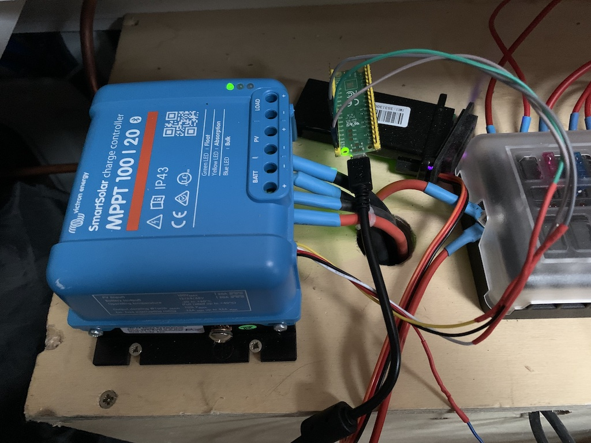
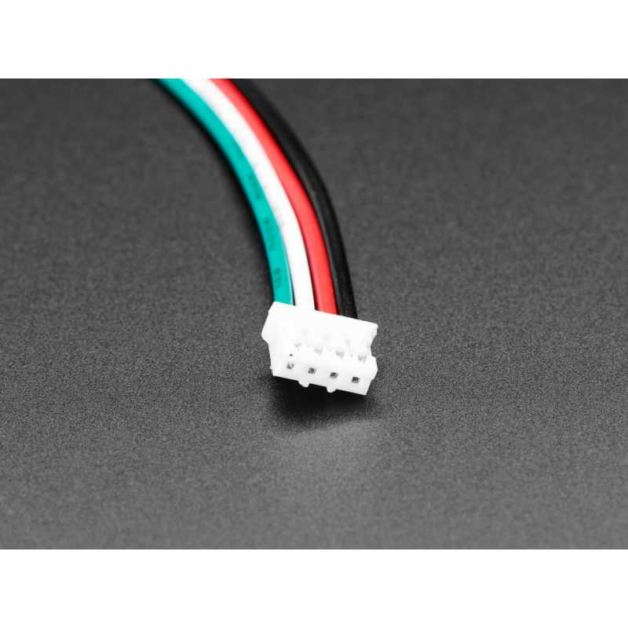
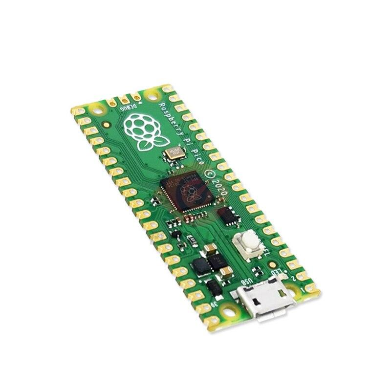

# Victron Display 



## Introduction

This is an experimental repo. My goal is to parse the VE.Direct protocol from Victron with [TinyGo](https://tinygo.org/) on a [Raspberry Pico](https://www.raspberrypi.com/products/raspberry-pi-pico/).

See specifications of the protocol [here](/doc/VE.Direct-Protocol-3.32.pdf)

I want to have a display in my van to see :
- Battery voltage and current
- Solar panel Voltage and Current
- Current State of the MPTT Controller
- Maximum power
- Minimum and maximum voltage

Roadmap:

- [X] Parsing VE.Direct protocol
- [X] Connect to the MPTT
- [X] Flashing the pico nano with firmware
- [X] Refactoring to avoid heap allocations
- [ ] Add a display
- [ ] Testing, optimizing, reliability


### Basic concepts

```
flowchart LR
    subgraph hardware
    MPTT(Victron MPTT) --> R[Rasp Pico]
    end
    subgraph software
    R --> P[Parsing]
    P -- "map[string]string{}" --> Frame
    Frame -- "struct{}" --> State
    end
```

### Hardware

#### Socket

You will need a `JST PH 4` female socket to connect your Victron device to the Raspberry



#### Microcontroller

In this POC I used a Rasbberry Pico, cheap and well supported by TinyGO: https://tinygo.org/docs/reference/microcontrollers/pico/



### Flash the pico

```
tinygo flash -target=pico main.go
```

### Testing the VE.Direct parsing lib

```
go test -v ./vedirect
```

It relies on a dump of my `SmartSolar 100/20`

### Build and track heap allocation

More info available [here](https://tinygo.org/docs/concepts/compiler-internals/heap-allocation/).

As you may see, I had to modify a bit my usual gopher habits to reduce the number of heap allocations, in order to optimize the memory management of the microcontroller.

Here some adjumemts
- no pointer in "constructor like" method (aka `New() (*myStruct, err)`)
- passing by value instead of reference in method :
  - ex `func (m *myStruct) myMethod error` --> `func (m myStruct) myMethod (m myStruct, err error)`

```
tinygo build -o firmware.uf2 -target=pico -print-allocs=.  main.go 2> >(grep victron)
```